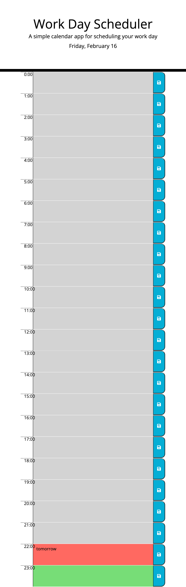

# daily-planner
## Description
This is a daily planner app that allows the user to track their daily activities.

## Installation
CLick [here](url) for the deployed app

## Usage

This web app allows the user to plan their day. Simply add an activity in a green time block. The green time block represents free/future time. Clicking on the save icon allows users to save activities or whatever they choose to input in the tim block.
The red time block represents present time, while the grey time block represents past time. 

## Credits
N/A

## License
MIT license. Please refer to the license in the repo.